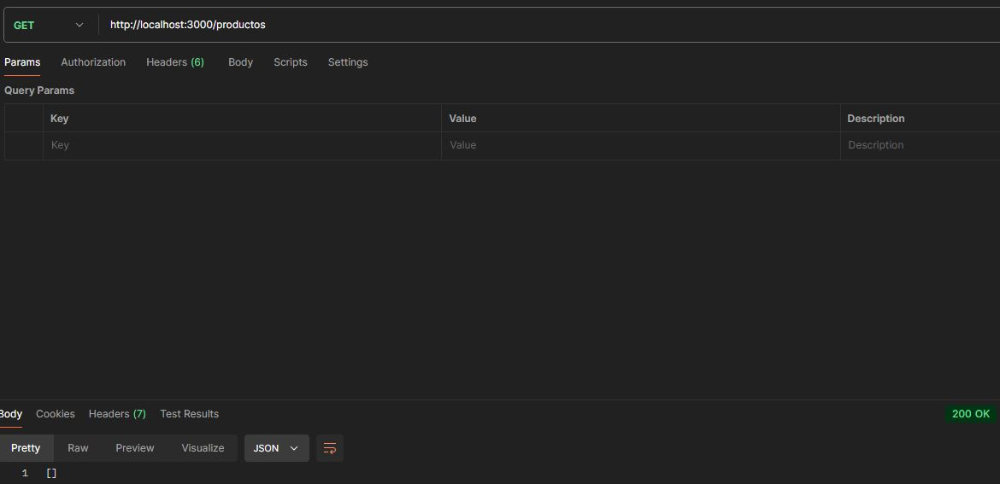
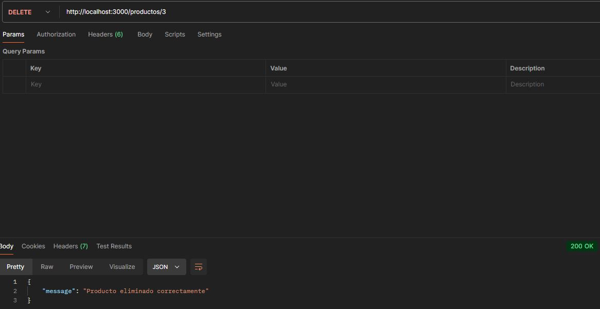
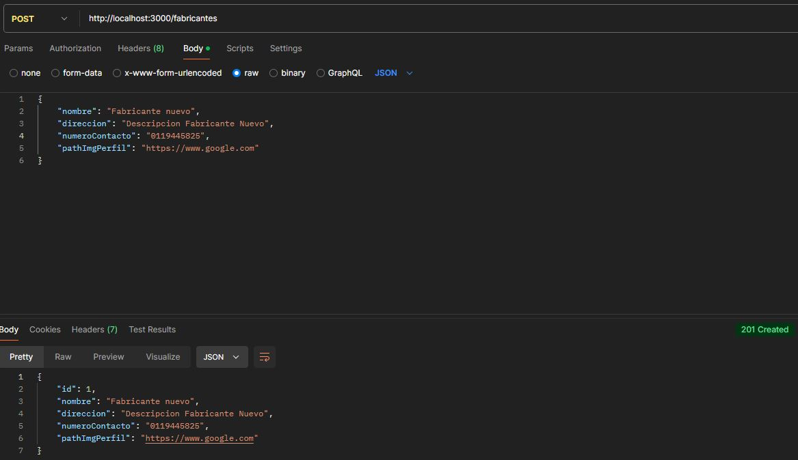
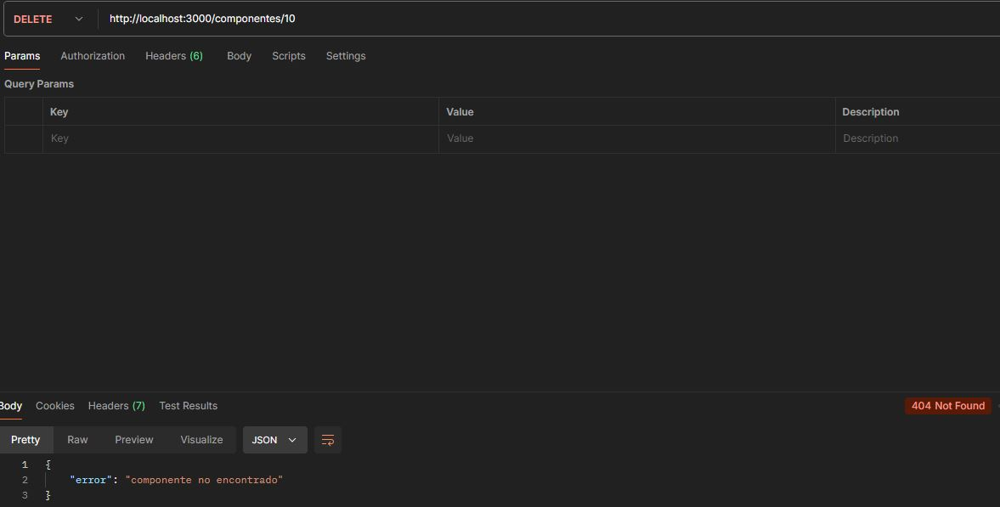

[](https://classroom.github.com/a/NoutYWiV)
# Estrategias de Persistencia - TP 2024


## Descripción del Proyecto

Se ha desarrollado un sistema interno de gestión de productos para una empresa de manufactura. La empresa fabrica una amplia gama de productos tecnológicos que requieren componentes específicos y son producidos por múltiples fabricantes asociados.

La problemática de la empresa por la que se decidió hacer este sistema es que el proceso de gestión de la información es manual y está descentralizado, lo que genera demoras y problemas en la producción. 

Se decidió automatizar y centralizar estos datos mediante un sistema web eficiente que permita gestionar los productos, fabricantes y componentes de manera integrada.


## Información de la API a implementar
Se decidió implementar un modelo relacional y se utilizó el siguiente diagrama de entidad-relación (DER) para generar los modelos y las asociaciones en Sequelize para que la API pueda interactuar con la base de datos a través de los Modelos.


### Descripción del modelo DER
- Un **Producto** puede tener muchos fabricantes, y un **Fabricante** puede fabricar muchos productos.
- Un **Producto** puede tener muchos componentes, y un **Componente** puede formar parte de varios productos.


### Base de datos
El sistema utiliza el motor de base de datos sqlite para realizar pruebas simples pero se pueden utilizar otros motores como MySql o Postgres.


## Instrucciones necesarias para correr la API.
Instalar las dependencias utilizadas en la API. 
Para esto hay que utilizar el comando: ```npm install```
Esto instalará las dependencias: ``` express - joi - sequelize - sqlite3 ```
Y luego utilizar el comando: ```npm start``` 


## API

#### Organización del código:
- El código está organizado en rutas, controllers y middleware utilizando la separación por recurso.


### Endpoints
- Todas las peticiones que se realicen a la API deben ser enviadas en **localHost** con el **puerto 3000** que se encuentra por defecto, o modificarlo por variable de entorno.

Ejemplos de cada recurso de la API con las diferentes respuestas:


**Verbo:** GET 

**Recurso:** /productos

**Status code:** 200

**Descripción:** Obtiene todos los productos. En caso de que no haya productos devuelve un array vacío.

**Ejemplos:** 

*Sin productos - Status code 200*



*Todos los productos - Status code 200*


**Verbo:** GET 

**Recurso:** /productos/:id

**Status code:** 200 y 404

**Descripción:** Obtiene el producto identificado con el id que se le pase en el recurso. En caso de que ese producto no se encuentre devuelve un mensaje de error.

**Ejemplos:** 

*Status code 200*


*Status code 404*


**Verbo:** POST 

**Recurso:** /productos

**Status code:** 201 y 400

**Descripción:** Crea un producto. En caso de pasar mal algún dato lanza un mensaje de error indicando cuál es el error.

**Ejemplo:**

*Status code 201*


*Status code 400*


**Verbo:** PUT

**Recurso:** /productos/:id

**Status code:** 200, 400 y 404

**Descripción:** Modifica los datos del producto identificado con el id que se le pase en el recurso. En caso de que ese producto no se encuentre o se pase mal algún dato, devuelve un mensaje de error indicando cuál es el error.

**Ejemplo:** 

*Status code 200*


*Status code 400*


*Status code 404*


**Verbo:** DELETE

**Recurso:** /productos/:id

**Status code:** 200, 404 y 500

**Descripción:** Borra el producto identificado con el id que se le pase en el recurso. En caso de que ese producto no se encuentre o no se pueda eliminar, devuelve un mensaje de error.

**Ejemplo:** 

*Status code 200*



*Status code 404*


**Verbo:** POST

**Recurso:** /productos/:id/fabricantes

**Status code:** 201, 404 y 400

**Descripción:** Crea la asociación del producto identificado con el id que se le pase en el recurso con 1 o N fabricantes.

**Ejemplo:**

*Status code 201*


*Status code 404*


*Status code 400*


**Verbo:** GET 

**Recurso:** /productos/:id/fabricantes

**Status code:** 200 y 404

**Descripción:** Obtiene todos los fabricantes del producto identificado con el id que se le pase en el recurso. 

**Ejemplo:**

*Status code 200*


*Status code 404*


**Verbo:** POST 

**Recurso:** /productos/:id/componentes

**Status code:** 201, 404 y 400

**Descripción:** Crea la asociación del producto identificado con el id que se le pase en el recurso, con 1 o N componentes. 

**Ejemplo:** 

*Status code 201*


*Status code 404*


*Status code 400*


**Verbo:** GET

**Recurso:** /productos/:id/componentes

**Status code:** 200 y 404

**Descripción:** Obtiene todos los componentes del producto identificado con el id que se le pase en el recurso.

**Ejemplo:**

*Status code 200*


*Status code 404*


---
**Verbo:** GET

**Recurso:** /fabricantes

**Status code:** 200

**Descripción:** Obtiene todos los fabricantes. En caso de que no haya fabricantes devuelve un array vacío.

**Ejemplo:** 

*Sin fabricantes - Status code 200*


*Todos los fabricantes - Status code 200*


**Verbo:** GET

**Recurso:** /fabricantes/:id

**Status code:** 200 y 404

**Descripción:** Obtiene el fabricante identificado con el id que se le pase en el recurso. En caso de que ese fabricante no se encuentre devuelve un mensaje de error.

**Ejemplo:** 

*Status code 200*


*Status code 404*


**Verbo:** POST

**Recurso:** /fabricantes

**Status code:** 201 y 400

**Descripción:** Crea un fabricante. En caso de pasar mal algún dato lanza un mensaje de error indicando cuál es el error.

**Ejemplo:**

*Status code 201*



*Status code 400*


**Verbo:** PUT

**Recurso:** /fabricantes/:id

**Status code:** 200 y 404

**Descripción:** Modifica los datos del fabricante identificado con el id que se le pase en el recurso. En caso de que ese fabricante no se encuentre o se pase mal algún dato, devuelve un mensaje de error indicando cuál es el error.

**Ejemplo:** 

*Status code 200*


*Status code 400*


*Status code 404*


**Verbo:** DELETE

**Recurso:** /fabricantes/:id

**Status code:** 200, 404 y 500

**Descripción:** Borra el fabricante identificado con el id que se le pase en el recurso. En caso de que ese fabricante no se encuentre o no se pueda eliminar, devuelve un mensaje de error.

**Ejemplo:** 
*Status code 200*


*Status code 404*


**Verbo:** GET

**Recurso:** /fabricantes/:id/productos

**Status code:** 200 y 404

**Descripción:** Obtiene todos los productos del fabricante identificado con el id que se le pase en el recurso. 

**Ejemplo:**

*Status code 200*


*Status code 404*


---
**Verbo:** GET

**Recurso:** /componentes

**Status code:** 200

**Descripción:** Obtiene todos los componentes. En caso de que no haya componentes devuelve un array vacío.

**Ejemplo:**

*Sin componentes - Status code 200*


*Todos los componentes - Status code 200*


**Verbo:** GET

**Recurso:** /componentes/:id

**Status code:** 200 y 404

**Descripción:** Obtiene el componente identificado con el id que se le pase en el recurso. En caso de que ese componente no se encuentre devuelve un mensaje de error.

**Ejemplo:** 

*Status code 200*


*Status code 404*


**Verbo:** POST

**Recurso:** /componentes

**Status code:** 201 y 400

**Descripción:** Crea un componente. En caso de pasar mal algún dato lanza un mensaje de error indicando cuál es el error.

**Ejemplo:**

*Status code 201*


*Status code 400*


**Verbo:** PUT

**Recurso:** /componentes/:id

**Status code:** 200 y 404

**Descripción:** Modifica los datos de el componente identificado con el id que se le pase en el recurso. En caso de que ese componente no se encuentre o se pase mal algún dato, devuelve un mensaje de error indicando cuál es el error.

**Ejemplo:** 

*Status code 200*


*Status code 400*


*Status code 404*


**Verbo:** DELETE

**Recurso:** /componentes/:id

**Status code:** 200, 404 y 500

**Descripción:** Borra el componente identificado con el id que se le pase en el recurso. En caso de que ese componente no se encuentre o no se pueda eliminar, devuelve un mensaje de error.

**Ejemplo:** 

*Status code 200*


*Status code 404*



**Verbo:** GET 

**Recurso:** /componentes/:id/productos

**Status code:** 200 y 404

**Descripción:** Obtiene todos los productos del componente identificado con el id que se le pase en el recurso.

**Ejemplo:**

*Status code 200*


*Status code 404*

